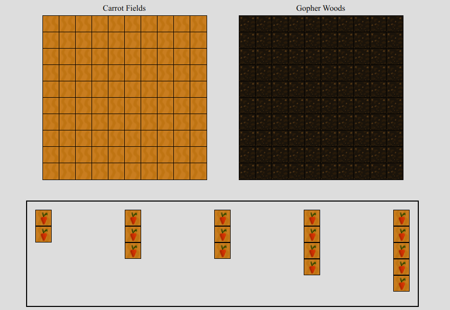
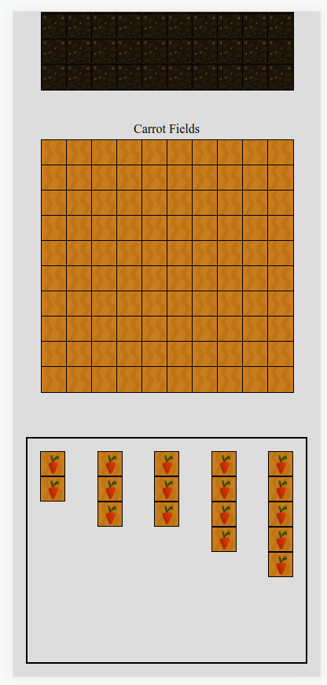
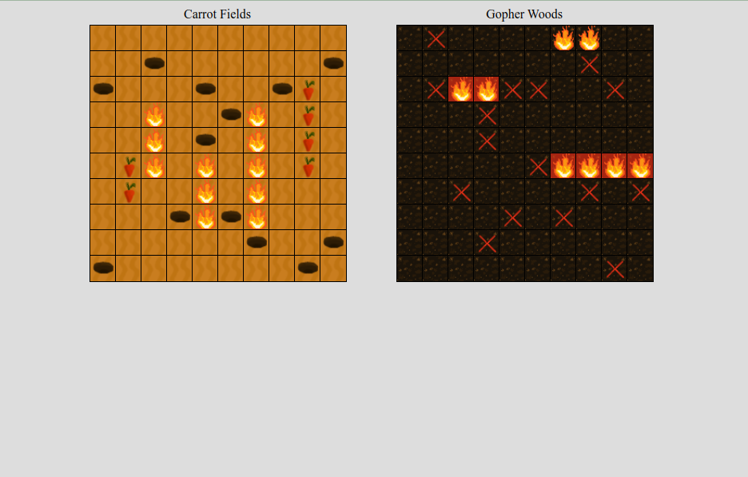
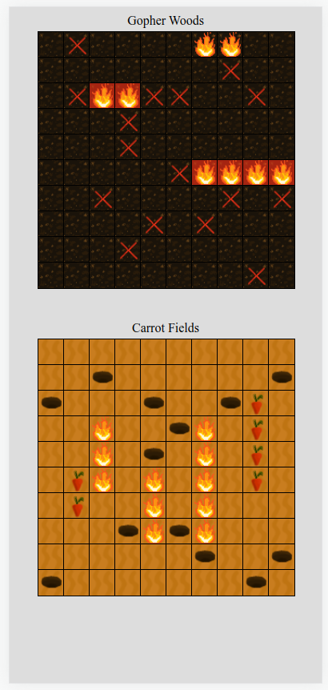
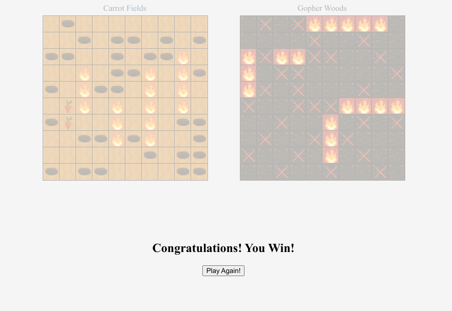
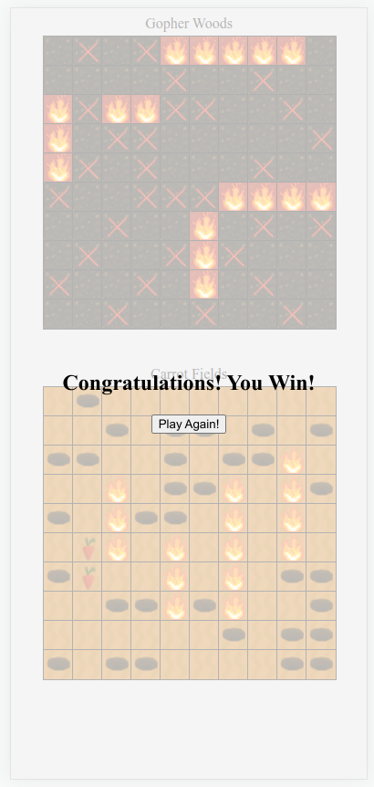

# Gopher Wars

## Introduction

Gopher Wars is a re-imagining of the classic board game Battleship, where the player takes the role of an angry farmer seeking to eradicate an infestation of gophers (played by a computer oponent) which threatens the player's carrot farm.  

The game is currently live and hosted through gitHub pages, [click here to check it out](https://scottank.github.io/gopherWars/ "Gopher Wars on gitHub pages")  

## Getting Started

### Gameplay  

To place or move a piece, simply click (or tap) on it to select, and click somewhere on the Carrot Fields grid to place it. Once a piece is on the grid, double click it to rotate.  

When you are happy with the arangement of your pieces, click the start game button to lock them in place. Then click squares on the Gopher Woods grid to fire shots at the gophers, the computer will automatically fire back, displaying hits and misses on the Carrot Fields grid.  

### Rules  

- All pieces must be placed completely within the 10x10 grid
- The two sides alternate turns, taking one shot per turn without knowing where their opponent's pieces are
- After a player chooses a target, the oponent must say if the shot hits a piece or misses
- Additionally if every space on a given piece has been hit this information must be shared with the opponent
- The game ends when all the pieces on one player's board have been destroyed

## Technology

- The game view is written in HTML and CSS
- Game control logic, model, and computer opponent are written in JavaScript
- Code formatting is enforced with Prettier
- Artwork was drawn in GIMP

## Interface

At the begining of the game, the player's pieces sit outside the board waiting to be placed.  

Dektop                                                           | Mobile
:---------------------------------------------------------------:|:--------------------------------------------------------------:
|

Once pieces are placed and the game starts, all the shots taken by both sides are visible as little fireballs, craters, or red crosses (I would have loved to make a more stimulating miss indicator for the player, but my pixel art skills fell short of the challenge). When every space on a gopher den has been hit, it is highlighted in red. In the image below, the 2-piece and 4-piece dens have been destoyed, while two hits have been landed on a den at the top which still has an unknown number of remaining spaces to hit. 

Dektop                                                  | Mobile
:------------------------------------------------------:|:-----------------------------------------------------:
|

When one side has destroyed all of their oponent's pieces a semi-transparent overlay tells the user who won, and invites them to play agin. The "play again" button will reset all the pieces so the player can start placing carrot plots again.

Dektop                                                           | Mobile
:---------------------------------------------------------------:|:--------------------------------------------------------------:
|

## Development

### Planning

Development of this game began with planning user stories and wireframing several generations of the game. Those plans were among the first files committed to the repository, and are preserved for posterity in the [planning directory](planning/README.md). The game is currently at the MVP level of development, and many of the version 2 and 3 user stories remain relevant objectives for future development.

### Structure

Gopher Wars uses a model-view-controller architecture. A central Game object contains all of the data about location of game pieces, shots taken, hits and misses, and the game winner. The Game object also exposes methods to the controller that allow it to communicate user input and request game status information.  

The game view is represented in HTML and CSS, which is updated through render functions that pull information from the Game object.  

Controller code in main.js attaches listeners to the view which call on Game object methods when the user has selected pieces, picked places to put them, started the game, and picked targets to shoot. Those event triggers end by calling render functions to update the view with the latest game state from the Game object. Due to the modular nature of the code, none of these methods are accessible from the browser console, but enabling the debugMode flag in main.js will create global variables to expose the game object, reset and render functions, and the showDens function which allows the player to see the gopher dens for debugging purposes.   

The gameState module defines the Game class as well as the GopherAI class which controlls the computer player.  

The gamePieces module defines all the interactive pieces of the game. These include the CarrotPlot and GopherDen classes which define the pieces on the board and contain methods for moving and rotating them. This module also defines PlayerSquare and GopherSquare which the controller uses to initialize the game board.  

Finally the tests module defines a set of tests which can be enabled with the runTests flag in the main.js module to automatically test the placement and rotation features when the game loads. These tests print results to the console and provide a convinient way to ensure that future changes don't break core features.  