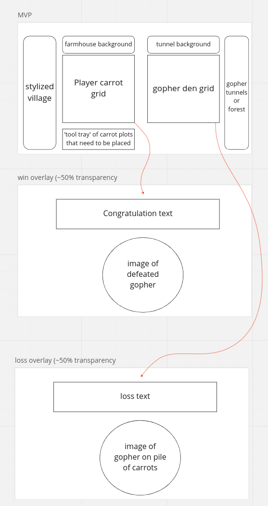
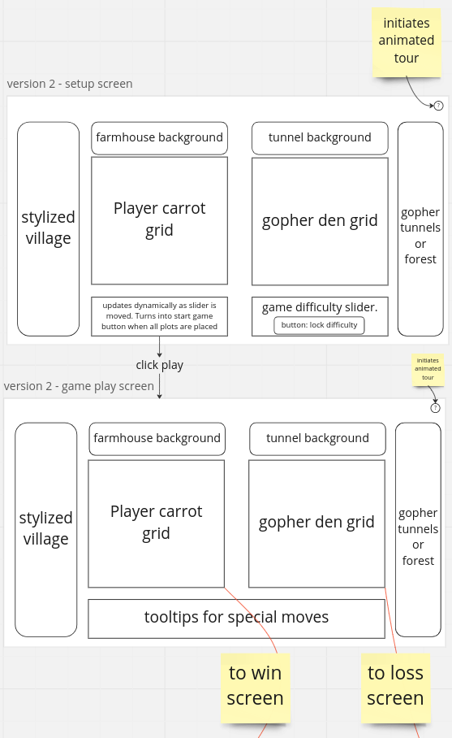
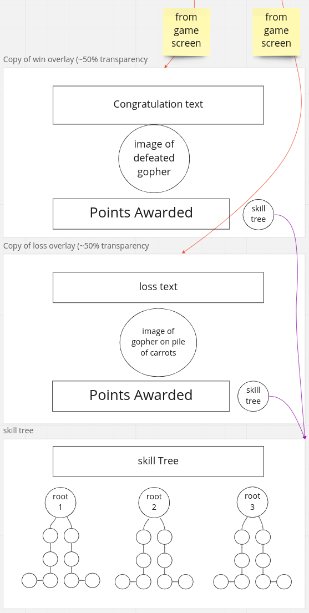

# Gopher Wars  

## Introduction  

Trouble has arrived in our idyllic villiage.  

An invading arm of gophers threatens the carrot farming industry of this community. The villiage council has deputized you as Supreme Carrot Commander and given you full access to the villiage's nuclear arsenal. Position your carrot plots strategically, make the right surgical strikes, and you may just have enough carrots left to survive the nuclear winter. Good luck commander.  

## Layout  

the MVP UI features two grids which will display where the user and the AI have landed hits, and which of those hits missed or found a target. At tool tray at the bottom of the UI initially holds the carrot plots, which must be placed before the user can start the game. 

When the game ends on of two end game displays will overlay the game screen congratulating or consoling the player, along with a matching image of the titular gopher.  

  

version two encorporates more animations. Notably, the carrot plot tool tray disappears after the game starts. That space in the UI is replaced with a tray of special abilities. This version also introduces a walkthrough animation that highlights the user controls and explains their effects. The win screen and loss screen remain unchanged from the MVP  

  

Version 3 adds in a great deal of player progression. A skill tree is available from the win/loss screens which allows the player to spend points earned in games to unlock abilities in the categories of attacks, defence, and intelligence

# User Stories  

### MVP  

- As a user I need to be able to position my carrot plots  
- As a user I need to be able to rotate my carrot plots
- As a user I need to be able to start the game after the plots are all on the grid
- As a user I need to be able to select a target on the gopher grid  
- As a user I need to know if my attack hit a gopher den  
- As a user I need to know if my carrot patches have been hit by gophers  
- As a user I need to be able to see all my past targets
- As a user I need to be able to see all the gopher attack targets  
- As a user I need a computer opponent  
- As a user I need a display that shows when the game is done and the winner

### Version 2  

- As a user I need an animated tutorial for controls  
- As a user I need the carrot plot tray to disappear after all the plots have been positioned
- As a user I need a difficulty slider that breaks the carrots into smaller plots  
- As a user I need a local PvP game  
- As a user I need to get a hint after X consecutive misses (X dependent on difficulty)
- As a user I need bonus powerups for hits and/or collapsing a den (sinking a ship)

### Version 3  

- As a user I need to have a skill tree  
- As a user I need to be able to save games and return later  
- As a user I need to be able to save profile progression
- As a developer I need an interface to adjust profile progression to test different levels
- As a user I need to be have game scenarios with different size grids
- As a user I need to win more points for playing harder scenarios, higher difficulty settings, and winning

