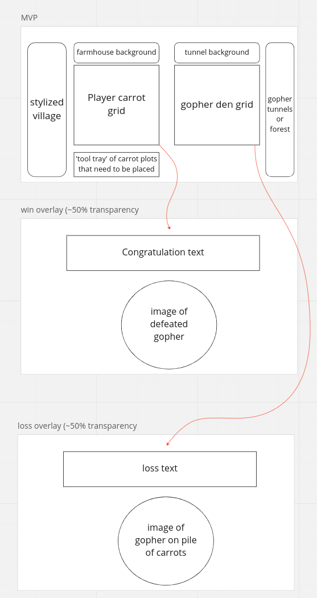
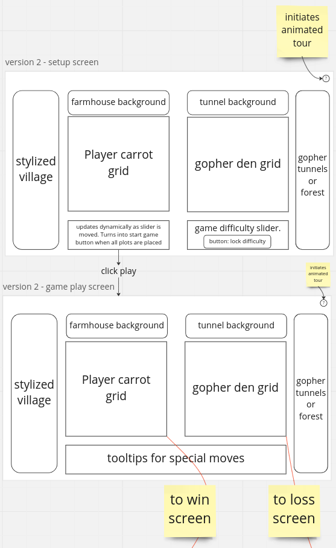

# Gopher Wars  

## Introduction  

Trouble has arrived in our idyllic villiage.  

An invading arm of gophers threatens the carrot farming industry of this community. The villiage council has deputized you as Supreme Carrot Commander and given you full access to the villiage's nuclear arsenal. Position your carrot plots strategically, make the right surgical strikes, and you may just have enough carrots left to survive the nuclear winter. Good luck commander.  

## Layout  

the MVP UI features two grids which will display where the user and the AI have landed hits, and which of those hits missed or found a target. At tool tray at the bottom of the UI initially holds the carrot plots, which must be placed before the user can start the game. 

When the game ends on of two end game displays will overlay the game screen congratulating or consoling the player, along with a matching image of the titular gopher.  

  

version two encorporates more animations. Notably, the carrot plot tool tray disappears after the game starts. That space in the UI is replaced with a tray of special abilities. This version also introduces a walkthrough animation that highlights the user controls and explains their effects. The win screen and loss screen remain unchanged from the MVP  

  


Version 3 adds in a great deal of player progression. A skill tree is available from the win/loss screens which allows the player to spend points earned in games to unlock abilities in the categories of attacks, defence, and intelligence

  

# User Stories  

### MVP  

- As a user I need to see a play grid for myself and the gophers
    ```
    in html:
    div with id 'playerGrid'
        100x divs with class 'playerSquare gridSquare'
        each div also gets attributes data-column and data-row which will assist with placing carrot plots
        and gopher hit marks
    div with id 'gopherGrid'
        100x divs with class 'gopherSquare gridSquare'
        each div also gets attributes data-column and data-row which will assist with placing player hits
    
    in css:
    id playerGrid gets grid template with 10 columns and rows
    id gopherGrid gets grid template with 10 columns and rows
    ```
- As a user I need to be able to position my carrot plots  
    ```
    in html:
    div with id 'plotTray'
        divs with class 'carrotPlot vertical' 
            divs with class 'carrotSquare gridSquare'
            each carrotPlot can have different numbers of individualCarrot

    in css:
    id plotTray gets flex display with space between justify
    class carrotPlot gets flex display with justify flex start 
    class vertical gets flex direction column
    class horzontal gets flex direction row (this will be added via javascript when player rotates plot)
    class indvidualCarrot gets an image of the little carrot tops
    class selected gets an outline to distingush the selected plot

    in javascript:
    for each carrotPlot
        add event listener for click:
            for all carrotPlot divs
                remove class selected
            add class selected on this carrotPlot
            set activeplot variable equal to this carrotPlot
    add event listener for click to the playerGrid: 
        if activeplot isn't null:
            make activePlot a child of playerGrid
            set activePlot style elements gridColumnStart, gridRowStart according to coordinates of event target
            set activePlot gridRowEnd to a span equal to number of children of activePlot
    ```

- As a user I need to be able to rotate my carrot plots
    ```
    when carrot plot is added to playerGrid:
        set event listener for dblclick: 
            if element is vertical:
                set element gridcolumnend to element gridrowend
                set element gridrowend to span 1
            else:
                set element gridrowend to element gridcolumnend
                set element gridcolumnend to span 1
    ```
- As a user I need to be able to start the game after the plots are all on the grid
    ```
    inside playerGrid click listener:
        if plotTray has no children:
            make a button that says "play game"
            attach a listener to the button:
                instantiate a game object with the array of carrotPlots (these will be read to understand when the gophers have hit a carrot)
    ```
- As a user I need to be able to select a target on the gopher grid  
    ```
    add event listener for click to gopherGrid:
        if click target is a spot where a gopher den exists:
            set event target class to gopherHit
        else:
            set event target class to gopherMiss
    ```
- As a user I need to know if my attack hit a gopher den  
    `covered in previous pseudo code`
- As a user I need to be able to see all my past targets
    `covered in previous pseudo code`
- As a user I need to know if my carrot patches have been hit by gophers  
    ```
    when the gopher AI selects a target on player grid:
        if target is a spot where a player carrot exists:
            set target class to playerHit
            call gopher object's notifyHit method
            if the hit carrotPlot is fully hit:
                call gopher object's deadPlot method to notify of a dead plot
        else:
            set target class to playerMiss
    ```
- As a user I need to be able to see all the gopher attack targets  
    `covered in previous pseudo code`
- As a user I need a computer opponent  
    ```
    in game object:
        store a gopher variable that points to a new gopher object

    in gopher object:
        constructor method:
            this.activeHits = []
            this.previousShots =[]
        deadPlot method:
            for vertex in deadPlot:
                if vertex in this.activeHits:
                    remove vertex from this.activeHits
        notifyHit method:
            push hit coordinate to this.activeHits
        shoot method:
            //issues to be resolved here:
            //using 1 and -1 for directions left and right is problematic when the starting point is at the end or begining of a row respectively
            //poping off of the activeHits array happens before gopher knows if the next shot hits, 
            //  which can end in losing track of targets if the next shot misses but the carrot plot isn't finished off
            //in this scenario the gopher will keep shooting at the same bad target:
            //where spaces in [] are carrot plots and 1,2,3 represent gopher shots in chronological order
            // .   .   .   .   .   
            // .   .   .  [ ]  .   
            // .   .  [ ] [ ]  .   
            // .   3  [2] [1]  .   
            // .   .  [ ]  .   .   
            // .   .   .   .   .   
            // .   .   .   .   .   
            //the solution should be to break the activeHits lenght out into cases:
            //  length 0: pick a random spot not in previous targets. if time allows, implement some check for spacing to avoid clustering shots.
            //  length 1: pick a random direction, check if it's out of bounds, line wrapped, or a cold shot, shoot
            //  length >1: pick most recent hit, get direction from difference to next preveous hit, 
            //              if that leads out of bounds, change direction and move until out of range of active hits, shoot
            //              if that direction axis leads OOB/to a previous shot (not in active hits):
            //                  take most recent active hit and proceed on the cross axis
            //It may help to write a validTarget method which checks for OOB, cold shot, and line wrap
            while this.activeHits has any values in it:
                pop the last active hit
                const unTestedDirections=[1,-1,10,-10]
                for unTestedDirection in unTestedDirections:
                    if last active hit + unTested Direction is a value in this.activeHits:
                        if last active hit - unTestedDirection is in bounds:
                            push last active hit - unTestedDirection to this.previousShots
                            return last active hit - unTestedDirection
                use durstenfeld shuffle to reorder unTestedDirections
                while unTestedDirections has any values in it:
                    pop next direction from unTestedDirections
                    if last active hit + next direction is out of bounds:
                        continue
                    if last active hit + next direction leads to a space stored in this.previousShots:
                        continue
                    push last active hit + next direction in this.previousShots
                    return last active hit + next direction
                
            else:
                random generate a number 0-99
    ```
- As a user I need a display that shows when the game is done and the winner

### version1.5

- As a user I need the grid borders to be the same width around the edges and between rows/columns
- 

### Version 2  

- As a user I need an animated tutorial for controls  
- As a user I need the carrot plot tray to disappear after all the plots have been positioned
- As a user I need a difficulty slider that breaks the carrots into smaller plots  
- As a user I need a local PvP game  
- As a user I need to get a hint after X consecutive misses (X dependent on difficulty)
- As a user I need bonus powerups for hits and/or collapsing a den (sinking a ship)

### Version 3  

- As a user I need to have a skill tree  
- As a user I need to be able to save games and return later  
- As a user I need to be able to save profile progression
- As a developer I need an interface to adjust profile progression to test different levels
- As a user I need to be have game scenarios with different size grids
- As a user I need to win more points for playing harder scenarios, higher difficulty settings, and winning

